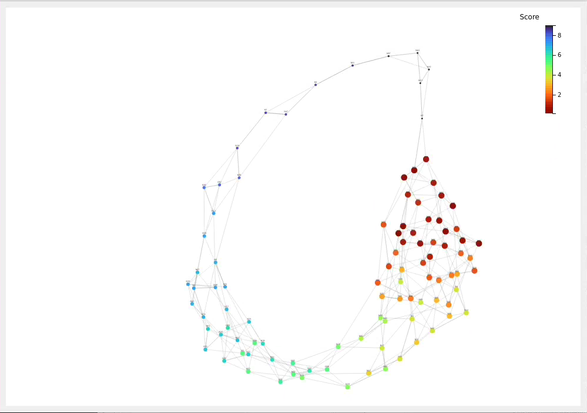
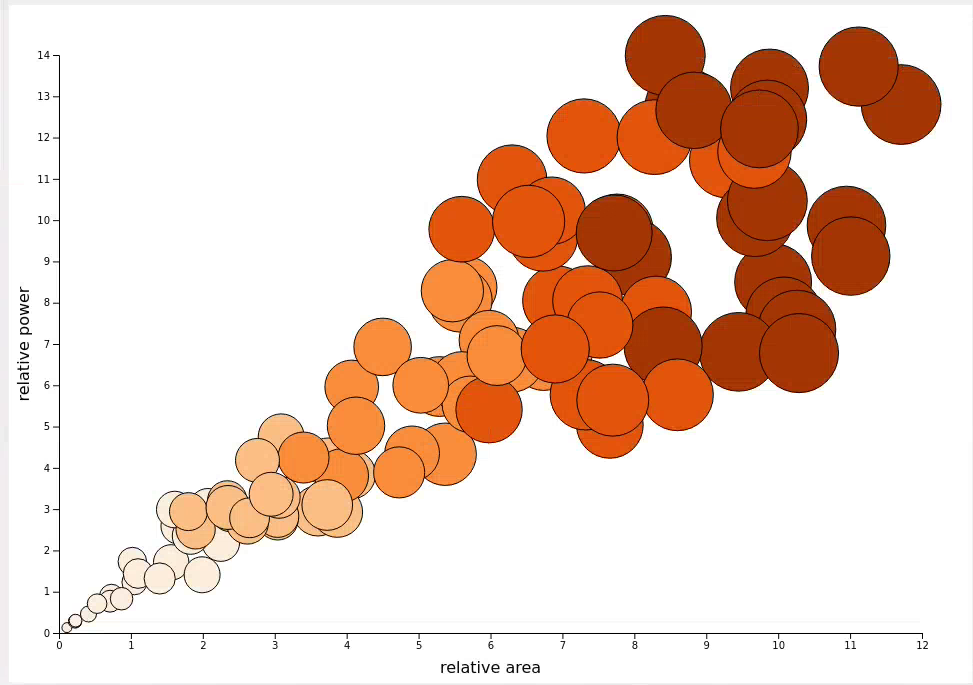
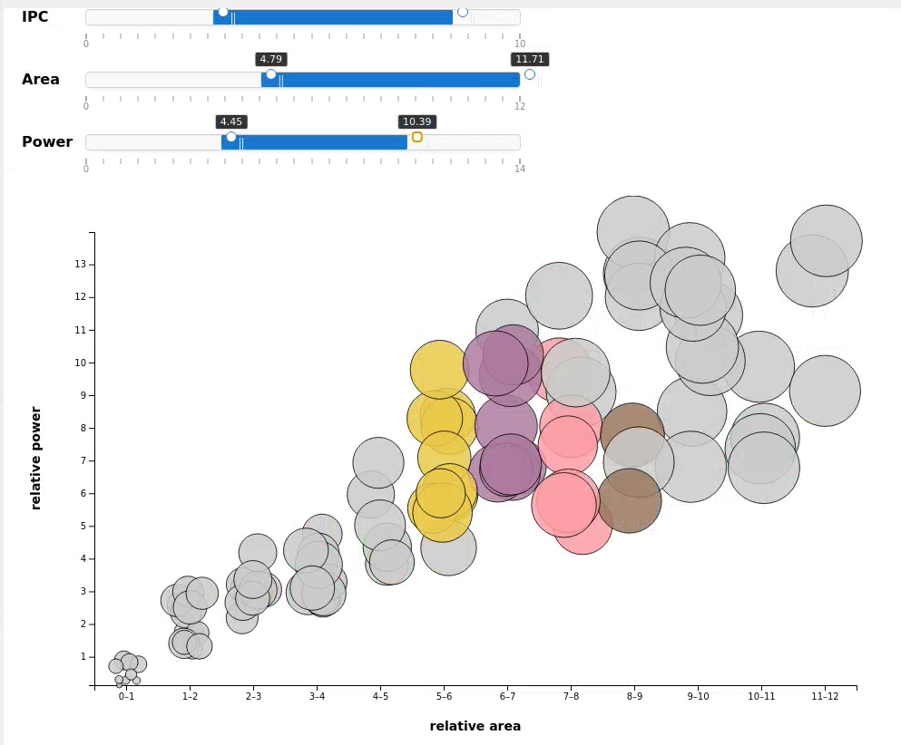
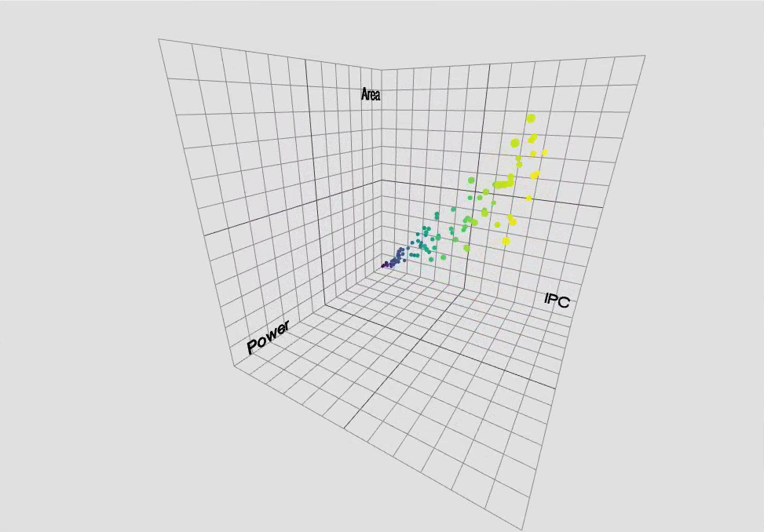
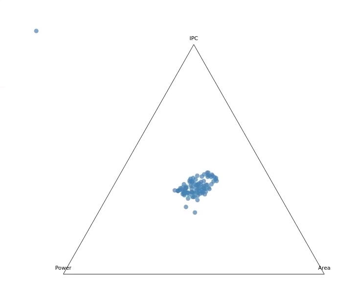

# tapir
Transformer Assisted Parameter Inference and Refinement

TAPIR is a tool for emitting configured RTL which meets constrained PPA goals
and analyzing the simulation results.

TAPIR also provides input to a performance model and an evaluation platform.
The example data set provides is the output of a Transformer/LLM based
design space exploration (DSE) flow on a configuration out-of-order RISC-V
processor model and RTL set.

The main interface to TAPIR uses tabbed table semantics to allow customization
of the parameter set through the GUI. The primary input/output for 
configurations is JSON.

TAPIR provides visualization tools to assist final configuration of an RTL
code base against constraints on power performance and area. 

In the example data set the PPA factors are expressed as weigthed estimates. 

The visualization tools include:

- A force directed graph of the parameter combinations
- A bubble chart plotting parameter sets againt relative power and area
- An interactive constraints selection chart which shows parameter sets 
  that meet the constraints set in the PPA selection sliders
- The scatter chart is a 3d visualization of PPA again parameters
- A ternary chart showing IPC, Power and Area against parameter distribution

<b>Force Directed Representation</b>
  

<b>Bubble Diagram of PPA</b>


<b>Interactive Parameter Range Selection</b>


<b>Scatter Plot of PPA</b>


<b>Ternary Plot of PPA</b>



## Dependencies
Ubuntu 22.04:
```
sudo apt-get install libxcb-cursor0 libxcb-xinerama0 libxcb-icccm4 libxcb-image0 libxcb-keysyms1 libxcb-render-util0
```

Qt5 webengine is also required, depending on your use not all of these are required
```
sudo apt-get install qtwebengine5-dev qtwebengine5-examples qtwebengine5-private-dev
```
# To build

clone the repo to tapir
cd tapir
qmake
make -j$(nproc)

# To run
Configuration files in json format express the parameter and option
sets. Public example configs are found in ./tapir/json

Project specific data files can be found in ./tapir.data/<project name>.
These files are not public.

To launch:

```
./bin/tapir
FileMenu->open json/<config>.json
```

# TODO

This is a partial list as of 2025.12.10

    - Scale on force chart should be flipped
        - standardize colors across all charts
        - condsider change to d3 color themes
    - Sliders on Swarm chart should be scaled smaller
    - Add sliders to other charts
    - ternary chart needs work, usefulness not apparent with random data
        - verify with real data
    - Area label on scatter chart should flip between the more
      visible power/area or ipc/area planes
    - add labeled ticks to axis in scatter chart

    - 
