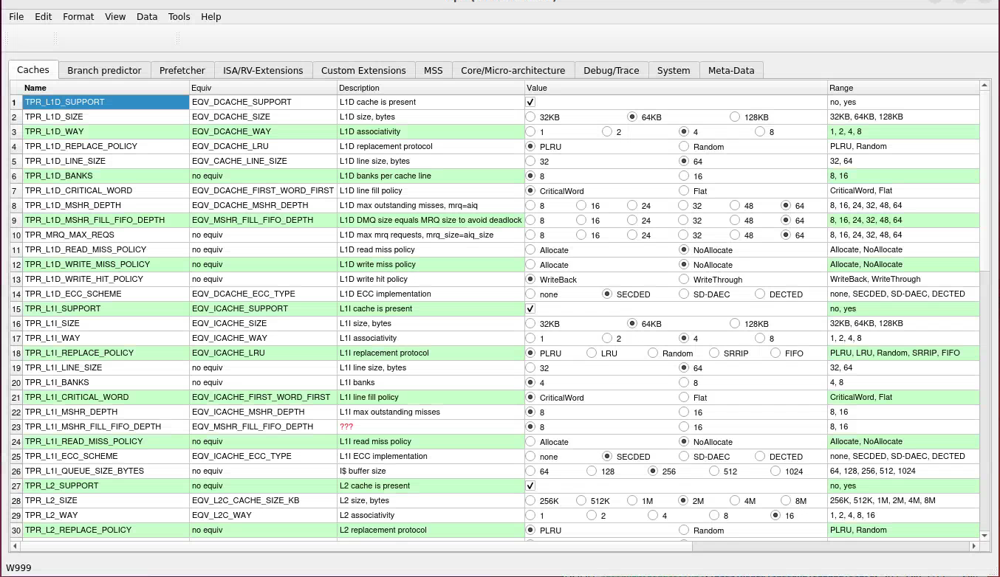

# tapir
Transformer Assisted Parameter Inference and Refinement

TAPIR serves as a central coordinator for the generation of power, performance,
and area (PPA) estimates for large-scale RISC-V processor designs and the
generation of RTL source fitting PPA goals.

In this role, TAPIR interacts with cloud-hosted large language models executing
design space exploration (DSE) tasks that produce evaluation datasets. TAPIR
assists in the specification, selection, and constraint of processor
parameters, which are used as inputs to the DSE flow. The DSE flow returns
datasets characterizing PPA behavior across the explored parameter space. TAPIR
then facilitates visualization of these results and enables user-driven
selection of design points, from which corresponding RTL configurations are
generated.

TAPIR is independent of any specific DSE implementation, processor model, RTL
dataset, or LLM hosting environment. It does not perform design space
exploration directly, but instead orchestrates and interprets the outputs of
external exploration and evaluation flows.

TAPIR is currently under development. The example dataset provided reflects a
simplified DSE execution on a public out-of-order RISC-V processor model. The
current interface supports visualization of this dataset. A future development
phase will add support for automated RTL and performance model configuration
generation.

As part of the DSE workflow, TAPIR also provides structured inputs to a
performance model and an evaluation platform. The example dataset represents
the output of a Transformer-based design space exploration flow applied to a
configurable out-of-order RISC-V processor model and RTL set. PPA values in the
dataset are expressed as weighted estimates.

TAPIR currently provides visualization tools to support final RTL configuration
selection under power, performance, and area constraints.

The configuration and visualization tools include:

- A tabbed parameter configuration and selection table with JSON-defined,
software-instantiated cell widgets

- A force-directed graph representing parameter combinations

- A bubble chart plotting parameter sets against relative power and area

- An interactive constraint selection chart highlighting parameter sets that satisfy PPA slider constraints

- A three-dimensional scatter plot visualizing PPA relationships across parameter space

- A ternary chart showing IPC, power, and area distributions across parameter sets

<b>Configuration Selection with JSON-specified controls</b>
  

<b>Force Directed Representation</b>
  

<b>Bubble Diagram of PPA</b>


<b>Interactive Parameter Range Selection</b>


<b>Scatter Plot of PPA</b>


<b>Ternary Plot of PPA</b>


## Dependencies
Ubuntu 22.04:
```
sudo apt-get install libxcb-cursor0 libxcb-xinerama0 libxcb-icccm4 libxcb-image0 libxcb-keysyms1 libxcb-render-util0
```

Qt5 webengine is also required, depending on your use not all of these are required
```
sudo apt-get install qtwebengine5-dev qtwebengine5-examples qtwebengine5-private-dev
```
# To build

clone the repo to tapir
cd tapir
qmake
make -j$(nproc)

# To run
Configuration files in json format express the parameter and option
sets. Public example configs are found in ./tapir/json

Project specific data files can be found in ./tapir.data/<project name>.
These files are not public.

To launch:

```
./bin/tapir
FileMenu->open json/<config>.json
```

# TODO

This is a partial list as of 2025.12.10

    - Scale on force chart should be flipped
        - standardize colors across all charts
        - condsider change to d3 color themes
    - Sliders on Swarm chart should be scaled smaller
    - Add sliders to other charts
    - ternary chart needs work, usefulness not apparent with random data
        - verify with real data
    - Area label on scatter chart should flip between the more
      visible power/area or ipc/area planes
    - add labeled ticks to axis in scatter chart

    - 
